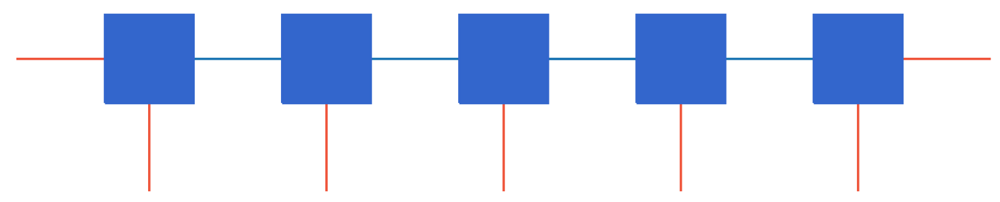
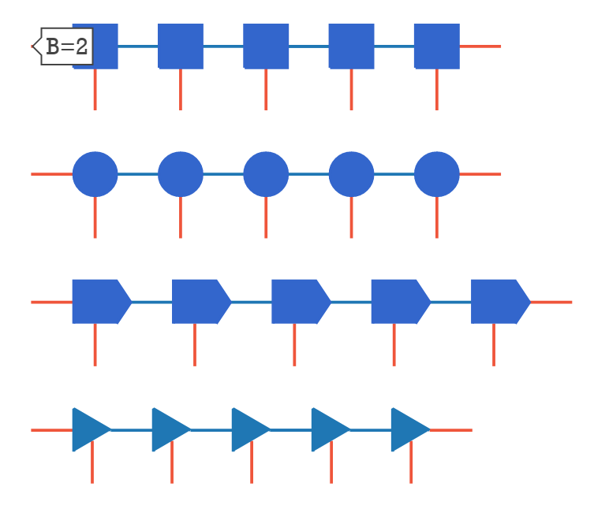
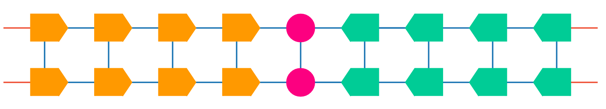
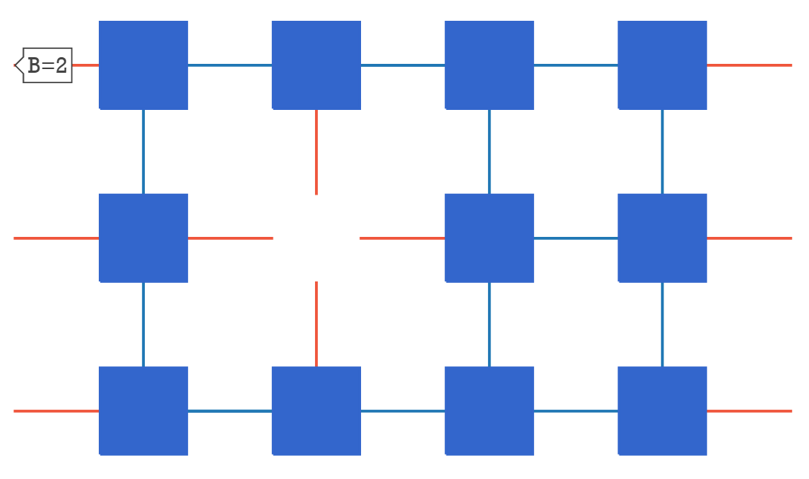
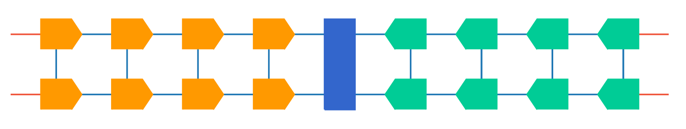

# Introduction

`TensorNetPlot` is a python package to help researchers fast create Tensor Network diagram.

### Example

The `Network` is store as 「Graph」-「Node」-「Bond」object.
In order to create a TN, one need creta a `Graph` first then add `node` and `edge` into. 


```python
from TensorNetPlot_element import GridGraph,Rectangle_T
tns=GridGraph("Demo")
num=5
layer=2
Tensor_Type = Rectangle_T
for i in range(num):
    tns.add_node(Tensor_Type(f"{i}",(2,3,2),bra_direction='─┬─'))
for i1,i2 in zip(range(num-1),range(1,num)):
    tns.add_edge((f"{i1}",-1),(f"{i2}",0))
tns.reset_layout()
tns.layout(bond_width=1,bond_length=1,spacing=1)
fig=tns.draw(show_name=True)
```



### Available Type

Now we realize following Tensor Unit
- Rectangle (Rectangle_T)
- Circle    (Circle_T)
- Flag      (Flag_T)
- Triangle  (Triangle_T)

#### demo


```python
from TensorNetPlot_element import Rectangle_T,Circle_T,Flag_T,Triangle_AS_T
from TensorNetPlot_utils import get_chain_mps
import plotly.graph_objects as go
mps_list = [get_chain_mps(name,_type,5,layer=1,main_direction ='r') for name,_type in [ 
    ['Rectangle',Rectangle_T],['Circle',Circle_T],['Flag',Flag_T],['Triangle',Triangle_AS_T]
]]
```


```python
fig = go.Figure()
axis = dict(showline=False, zeroline=False,showgrid=False,showticklabels=False,)
fig.update_layout(showlegend=False,xaxis=axis,yaxis=axis,plot_bgcolor='white')
fig.update_layout(
    hoverlabel=dict(
        bgcolor="white",
        font_size=16,
        font_family="Rockwell"
    )
)
fig.update_xaxes(fixedrange=True)
fig.update_yaxes(scaleanchor = "x",scaleratio = 1,)

objects = []
for i,mps in enumerate(mps_list):
    mps.layout(start_point=(0,-3*i))
    objects +=mps.depoly(fig,show_name=False)
for obj in objects:fig.add_trace(obj)            
#fig.show()
```



### Contract Two Tensor Network

contract multiple tensor networks will create new Graph and put all node/edge into this 'big' Graph.

Then we need assign the contracted bond. We can assign when 


`contract_TN`(`mps list`,`pair list`)

the `bond (a)` in `bond pair ([a,b])` can either be the bond's name or the bond object itself.


```python
from TensorNetPlot_element import Flag_T,Circle_T
from TensorNetPlot_utils import get_chain_mps,contract_TN
mps1 = get_chain_mps('L',Flag_T,num=4,layer=2,vertical=False,main_direction='r',color='#FF9900')
mps2 = get_chain_mps('C',Circle_T,num=1,layer=2,vertical=False,color='#FC0080')
mps3 = get_chain_mps('R',Flag_T,num=4,layer=2,vertical=False,main_direction='l',color='#00CC96')

mps = contract_TN([mps1,mps2,mps3],[])
free_bonds_l_r = mps1.free_bond('r') # .free_bond will return the free bond object with direction 'r'
free_bonds_c_l = mps2.free_bond('l')
free_bonds_c_r = mps2.free_bond('r')
free_bonds_r_l = mps3.free_bond('l')
mps.add_edge(free_bonds_l_r[0],free_bonds_c_l[0])
mps.add_edge(free_bonds_l_r[1],free_bonds_c_l[1])
mps.add_edge(free_bonds_c_r[0],free_bonds_r_l[0])
mps.add_edge(free_bonds_c_r[1],free_bonds_r_l[1])
mps.reset_layout()
mps.layout(bond_width=1,bond_length=1,spacing=1)
fig=mps.draw(show_name=True)
```



### Delte Node

Delte the node will free the contracted bond to free bond


```python
from TensorNetPlot_utils import get_chain_mps,contract_TN
from TensorNetPlot_element import Rectangle_T
mps = get_chain_mps('L',Rectangle_T,num=4,layer=3,vertical=False)
mps.delte_node('L_11')

mps.reset_layout()
mps.layout(bond_width=1,bond_length=1,spacing=1)
mps.draw()
```



## Advance Feature

### Big Tensor auto along

support insert big tensor block into left-right layout tensor network


```python
from TensorNetPlot_utils import get_chain_mps,contract_TN
from TensorNetPlot_element import GridGraph,Flag_T,OneSideBigRectangle_T
mps1 = get_chain_mps('L',Flag_T,num=4,layer=2,vertical=False,main_direction='r',color='#FF9900')
mps1.layout(bond_width=1,bond_length=1,spacing=1)
mps2 = GridGraph('C')
mps2.add_node(OneSideBigRectangle_T("BC",[2]*4,bond_direction='llrr'))
mps3 = get_chain_mps('R',Flag_T,num=4,layer=2,vertical=False,main_direction='l',color='#00CC96')

mps = contract_TN([mps1,mps2,mps3],[])
free_bonds_l_r = mps1.free_bond('r') # .free_bond will return the free bond object with direction 'r'
free_bonds_c_l = mps2.free_bond('l')
free_bonds_c_r = mps2.free_bond('r')
free_bonds_r_l = mps3.free_bond('l')
mps.add_edge(free_bonds_l_r[0],free_bonds_c_l[0])
mps.add_edge(free_bonds_l_r[1],free_bonds_c_l[1])
mps.add_edge(free_bonds_c_r[0],free_bonds_r_l[0])
mps.add_edge(free_bonds_c_r[1],free_bonds_r_l[1])
mps.reset_layout()
mps.layout(bond_width=1,bond_length=1,spacing=1)
fig=mps.draw(show_name=True)
```



## TODO

- show label
- flexible spacing
- better color mode
